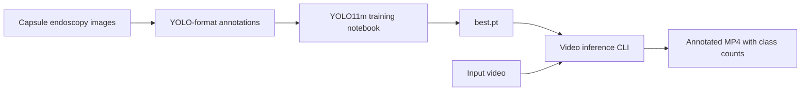

# Kvasir-Capsule Object Detection

[](https://www.python.org/)
[](https://docs.ultralytics.com/)
[](#project-status)

캡슐 내시경 영상에서 병변 후보를 탐지하기 위해 YOLO11m을 학습하고,
영상 프레임에 탐지 결과와 클래스별 개수를 표시하는 연구 프로젝트입니다.

This repository contains a Colab-oriented YOLO11m training notebook and a
reusable command-line video inference script.

> [!CAUTION]
> 이 프로젝트는 연구 및 교육 목적입니다. 출력은 의료진의 판독, 임상 진단,
> 치료 결정을 대신하지 않습니다.

## Project Status

The repository is an experiment record and inference utility, not a packaged
medical application.

| Component | Included | Notes |
| --- | --- | --- |
| YOLO11m training notebook | Yes | Colab-oriented; requires a YOLO-format dataset |
| Video inference CLI | Yes | Overlays detections and per-frame class counts |
| Dataset and labels | No | Must be obtained and prepared separately |
| Trained model weights | No | Pass a compatible `.pt` file at runtime |
| Reproducible benchmark report | No | Validation outputs are not tracked in this repository |

No performance numbers are claimed here because the repository does not contain
the evaluation artifacts needed to independently verify them.

## Workflow



## Repository Layout

```text
.
|-- notebooks/
|   |-- README.md
|   `-- yolo11m_training.ipynb       # Colab training and validation workflow
|-- scripts/
|   `-- video_inference.py           # Reusable video inference CLI
|-- .gitignore                       # Excludes data, weights, media, and outputs
|-- CONTRIBUTING.md
|-- README.md
`-- requirements.txt
```

## Quick Start: Video Inference

### 1. Clone and install

```bash
git clone https://github.com/Luke-Byun/Kvasir-Capsule-Object-Detection.git
cd Kvasir-Capsule-Object-Detection
python -m venv .venv
```

Activate the environment on macOS/Linux:

```bash
source .venv/bin/activate
```

Or on Windows PowerShell:

```powershell
.venv\Scripts\Activate.ps1
```

Install dependencies:

```bash
python -m pip install --upgrade pip
pip install -r requirements.txt
```

### 2. Run inference

Provide your own compatible trained weights and an input video:

```bash
python scripts/video_inference.py \
  --model /path/to/best.pt \
  --input /path/to/input.mp4 \
  --output outputs/annotated.mp4 \
  --confidence 0.25
```

Use `--device 0` for the first CUDA GPU or `--device cpu` to explicitly select
CPU inference. Run `python scripts/video_inference.py --help` for all options.

## Training Notebook

[`notebooks/yolo11m_training.ipynb`](notebooks/yolo11m_training.ipynb) covers:

- CUDA availability checks
- Ultralytics installation and YOLO11m initialization
- private dataset download prompting without storing credentials
- train/validation/test image discovery
- a 200-epoch training configuration
- validation, prediction, and result visualization cells

The notebook expects a YOLO-format dataset containing a `data.yaml` file and
`train`, `valid`, and `test` image/label splits. See
[the notebook guide](notebooks/README.md) before running it.

## Data and Artifacts

The following are intentionally excluded from Git:

- capsule endoscopy images and labels
- private dataset download URLs and API keys
- model weights (`.pt`, `.pth`, `.onnx`, `.engine`)
- training runs and validation artifacts
- input and output videos

Users are responsible for following the dataset's license, access terms, and
applicable research-data policies. Never open an issue or pull request containing
patient data, credentials, or private download links.

## Reproducing Results

For a result to be independently reproducible, record at least:

- dataset source, version, class names, and split definition
- annotation format and any preprocessing or augmentation
- package versions and hardware
- training seed and complete hyperparameters
- checkpoint selection rule
- per-class precision, recall, AP50, and AP50-95 on a held-out test split

The current notebook records many training settings, but the dataset manifest,
trained checkpoint, and exported validation metrics are not included.

## Limitations

- The training workflow contains Colab-specific paths and shell commands.
- Detection quality cannot be assessed from this repository alone.
- Per-frame counts are detections, not unique lesion counts across a video.
- False positives, missed lesions, and dataset shift are expected.
- The script does not track objects across frames or produce a clinical report.

## Contributing

Documentation, reproducibility, portability, and evaluation improvements are
welcome. Read [CONTRIBUTING.md](CONTRIBUTING.md) before submitting a pull request.

## License

This repository currently has no license file. Unless the owner adds one,
copyright law applies and reuse permission is not automatically granted.
